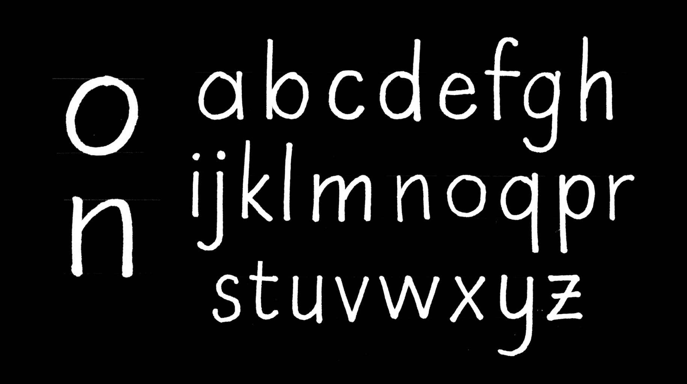
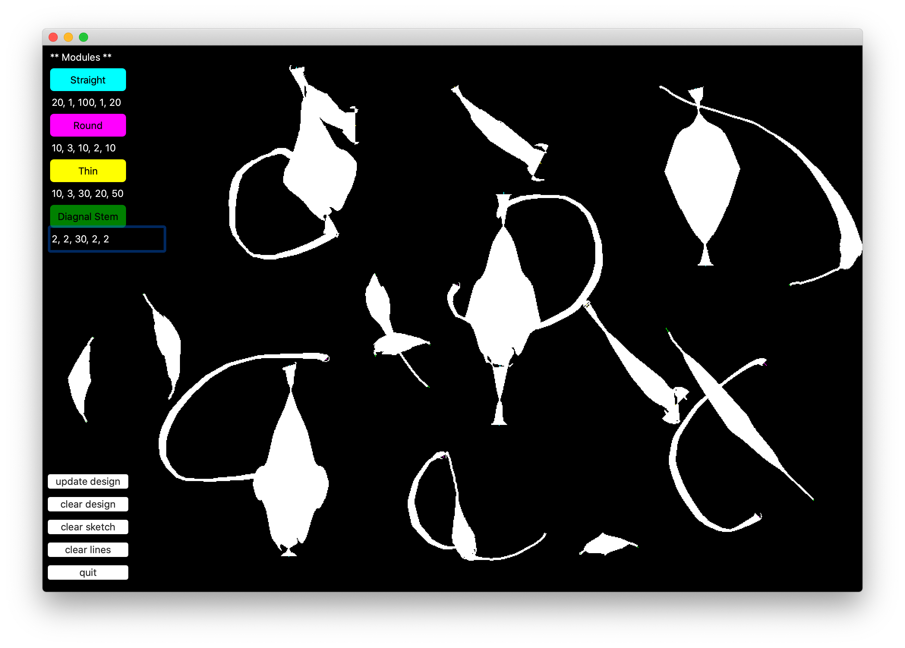

# Modular Type #

## A deep dive into the structure of the written language ##
What is the smallest unit of language? A quick google search on the topic tells me that a morpheme is the smallest unit of a language that can carry meaning — basically a word. The ‘smallest unit’ is a character — `a`, `b`, `c`, and so forth. But what if we could go further than that? A type designer knows that designs on the character is not unique. For example, a design of a `D` is derived from the left side of an `H` and the right side of an `O`. In the lower case, this is even more pronounced. With the ‘n’ and the ‘o’, we can effectively gain enough information to construct the `p`, `d`, `b`, and `q`. So then, perhaps these ‘letter parts’ could be argued to be the very smallest unit of language. What happens when we break it down into those smallest pieces, and try to modify the material of language from there?

## So, what IS the very smallest unit? ##

This kind of structure of ‘rational’ thinking probably can date back to the Renaissance and the [Roman du Roi](https://en.wikipedia.org/wiki/Romain_du_Roi). The so-called logical design of it wasn’t the most beautiful, but it did lay down the idea of the ‘rational letter’. There is also a recent attempt at breaking down the typeface Futura (I’ve seen it at art book fairs/McNally Jackson, but can’t find the book online).

## Initial Inspirations ##
When I was initially thinking about this project, I envisioned it as an interface where you can change parameters of the ‘molecular structure’ and it would change the entire outlook of the typeface. Ideally, it would have some sort of GUI where you can change parts, and it will affect a bigger body of type. Some similar attempts that have been made are [Phase](https://www.eliashanzer.com/phase/), and to a larger extent [V-Fonts](https://v-fonts.com) (although their objectives are obviously different).

## Some necessary parameters ##
The world of type is big, and for this project to work I think I would need to define what I am trying to ‘take apart’ into smaller pieces. Here is an early attempt at trying to 'slice' capital letterforms into components. 

## The Project in Action

#### Overview

This is a doodle sample that I made while drawing 'Squirrel'. The left four buttons show the four 'modes' of drawing that it can do, and you can modify the stroke properties by entering numerical values and pressing `enter`.

You can draw as you go while you modify the strokes.

If you want to update all your lines to have the same kind of strokes across the board though, you can hit `clear design` and  the interface will show you the colored `sketch` strokes that show you what kind of lines are on the drawing board. You can then run `update design`. 

Once you run `update design`, all the lines update! If you want to start over, you can always press `clear design`, `clear sketch` and `clear lines` to start over from scratch. 

## Notes and Thoughts from Class
- A pre-set skeleton of letters could be a good educational tool
- Perhaps it could be more interesting as a monospace typeface
- References to check out from Allison : [ABC Blocks](https://illuminatingloy.suzannechurchill.com/project/abc-blocks/), [Margaret Konkol post](https://mina-loy.com/endehorsgarde/alphabets-that-build-themselves/)

